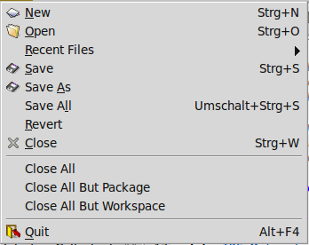
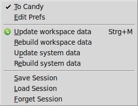

Appendix
========
**These docs are outdated, we are working on getting them up-to-date for the next release**

Command line arguments
----------------------

for leksah-server:

Leksah Haskell IDE (server) Usage: leksah-server [OPTION...] files...   

-s              --system               Collects new information for installed packages   

-r[Maybe Port]  --server[=Maybe Port]  Start as server.   

-b              --rebuild              Modifier for -s and -p: Rebuild metadata   

-o              --sources              Modifier for -s: Gather info about pathes to sources   

-v              --version              Show the version number of ide   

-h              --help                 Display command line options   

-d              --debug                Write ascii pack files   

-e Verbosity    --verbosity=Verbosity  One of DEBUG, INFO, NOTICE, WARNING, ERROR, CRITICAL, ALERT, EMERGENCY   

-l LogFile      --logfile=LogFile      File path for logging messages   

-f              --forever              Don’t end the server when last connection ends   

-c              --endWithLast          End the server when last connection ends  

for leksah:

Usage: leksah [OPTION...] files...   

-v            --Version              Show the version number of ide   

-l NAME       --LoadSession=NAME     Load session   

-h            --Help                 Display command line options   

-e Verbosity  --verbosity=Verbosity  One of DEBUG, INFO, NOTICE, WARNING, 

                                             ERROR, CRITICAL, ALERT, EMERGENCY

The Candy file
--------------

->        0x2192   Trimming       --RIGHTWARDS ARROW          

<-        0x2190   Trimming       --LEFTWARDS ARROW           

=>        0x21d2                  --RIGHTWARDS DOUBLE ARROW   

>=        0x2265                  --GREATER-THAN OR EQUAL TO  

<=        0x2264                  --LESS-THAN OR EQUAL TO     

/=        0x2260                  --NOT EQUAL TO              

&&        0x2227                  --LOGICAL AND               

\|\|        0x2228                  --LOGICAL OR                

++        0x2295                  --CIRCLED PLUS              

-- ::        0x2237 Trimming         --PROPORTION              

-- ..        0x2025                  --TWO DOT LEADER          

^         0x2191                  --UPWARDS ARROW             

==        0x2261                  --IDENTICAL TO              

 .        0x2218                  --RING OPERATOR              

\\         0x03bb                  --GREEK SMALL LETTER LAMBDA 

=<<       0x291e                  --                        

>>=       0x21a0                  --                          

-- $         0x25ca                  --                        

>>        0x226b                  -- MUCH GREATER THEN      

forall    0x2200                  --FOR ALL 

-- exist     0x2203                  --THERE EXISTS 

not       0x00ac                  --NOT SIGN

alpha     0x03b1                  --ALPHA 

beta      0x03b2                  --BETA 

gamma     0x03b3                  --GAMMA 

delta     0x03b4                  --DELTA 

epsilon   0x03b5                  --EPSILON 

zeta      0x03b6                  --ZETA 

eta       0x03b7                  --ETA 

theta     0x03b8                  --THETA

The Keymap file
---------------

--Default Keymap file for Leksah

--Allowed Modifiers are <shift> <ctrl> <alt> <apple> <compose>

--<apple> is the Windows key on PC keyboards

--<compose> is often labelled Alt Gr.

--The defined values for the keys can can be found at

-- http://gitweb.freedesktop.org/?p=xorg/proto/x11proto.git;a=blob\_plain;f=keysymdef.h.

-- The names of the keys are the names of the macros without the prefix.

--File

<ctrl>n                    ->          FileNew         Opens a new empty buffer

<ctrl>o                    ->          FileOpen        Opens an existing file

--<ctrl>x/<ctrl>f          ->          FileOpen        Opens an existing file

<ctrl>s                    ->          FileSave        Saves the current buffer

<ctrl><shift>s             ->          FileSaveAll     Saves all modified buffers

<ctrl>w                    ->          FileClose       Closes the current buffer

<alt>F4                    ->          Quit            Quits this program

--Edit

<ctrl>z                    ->          EditUndo        Undos the last user action

<shift><ctrl>y             ->          EditRedo        Redos the last user action

--<ctrl>x/r                ->          EditRedo        Redos the last user action

<ctrl>a                     ->          EditSelectAll   Select the whole text in the current buffer

<ctrl>f                     ->          EditFind         Search for a text string (Toggles the 

F3                          ->          EditFindNext     Find the next occurence of the text string

<shift>F3                   ->          EditFindPrevious Find the previous occurence of the text string

<ctrl>l                     ->          EditGotoLine    Go to line with a known index

<ctrl><alt>Right            ->          EditComment     Add a line style comment to the selected lies

<ctrl><alt>Left             ->          EditUncomment   Remove a line style comment

<alt>Right                  ->          EditShiftRight  Shift right

<alt>Left                   ->          EditShiftLeft   Shift Left

--View

<alt><shift>Left           ->          ViewMoveLeft    Move the current pane left

<alt><shift>Right          ->          ViewMoveRight   Move the current pane right

<alt><shift>Up             ->          ViewMoveUp      Move the current pane up

<alt><shift>Down           ->          ViewMoveDown    Move the current pane down

<ctrl>2                    ->          ViewSplitHorizontal

                                                    Split the current pane in horizontal direction

<ctrl>3                 ->          ViewSplitVertical

                                                    Split the current pane in vertical direction

<ctrl>1                 ->          ViewCollapse    Collapse the panes around the currentla selected pane into one

                        ->          ViewTabsLeft    Shows the tabs of the current notebook on the left

                        ->          ViewTabsRight   Shows the tabs of the current notebook on the right

                        ->          ViewTabsUp      Shows the tabs of the current notebook on the top

                        ->          ViewTabsDown    Shows the tabs of the current notebook on the bottom

                        ->          ViewSwitchTabs  Switches if tabs for the current notebook are visible

<ctrl>t                 ->          ToggleToolbar

                        ->          HelpDebug

                        ->          HelpAbout

<ctrl>b                 ->          BuildPackage

<ctrl>r                 ->          AddAllImports

<ctrl><alt>r            ->          RunPackage

<ctrl>j                 ->          NextError

<ctrl><shift>j          ->          PreviousError

<ctrl>o                 ->          ShowModules

--<ctrl>i                 ->          ShowInterface

-- <ctrl>i                 ->          ShowInfo

<ctrl><shift>e          ->          EditAlignEqual

<ctrl><shift>l          ->          EditAlignLeftArrow

<ctrl><shift>r          ->          EditAlignRightArrow

<ctrl><shift>t          ->          EditAlignTypeSig

<alt>i                  ->          AddOneImport

<alt><shift>i           ->          AddAllImports

-- For the next to entries the <ctrl> modifier is mandatory

<ctrl>Page\_Up           ->          FlipUp          Switch to next pane in reverse recently used oder

<ctrl>Page\_Down         ->          FlipDown        Switch to next pane in recently used oder

<ctrl>space             ->          StartComplete   Initiate complete in a source buffer

F6 -> DebugStep

F7 -> DebugStepLocal

F8 -> DebugStepModule

F9 -> DebugContinue

<ctrl>Return             ->          ExecuteSelection

<ctrl>m                  ->          UpdateMetadataCurrent

.. [1]
   Currently there is no way to load different layouts independent of
   the other data stored in a sessions.

.. |image| image:: screenshots/screenshot_edit_menu.png
.. |image| image:: screenshots/screenshot_workspace_menu.png
   :width: 25.0%
.. |image| image:: screenshots/screenshot_package_menu.png
   :width: 25.0%
.. |image| image:: screenshots/screenshot_debug_menu.png
   :width: 25.0%
.. |image| image:: screenshots/screenshot_buffer_menu.png
   :width: 25.0%
.. |image| image:: screenshots/screenshot_panes_menu.png
   :width: 15.0%
.. |image| image:: screenshots/screenshot_view_menu.png
   :width: 25.0%

