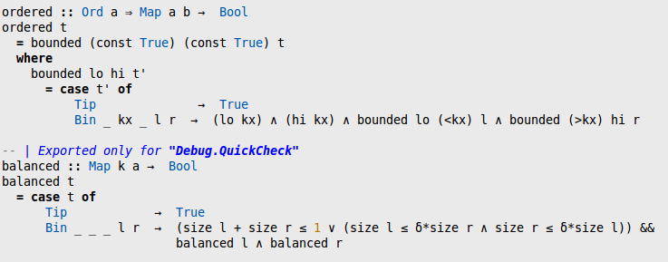
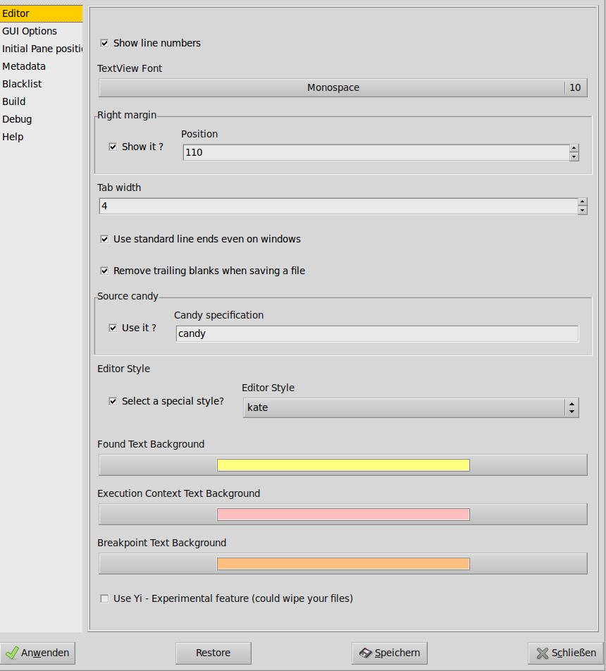

The Editor
==========
** These docs are outdated, we are working on getting them up-to-date for the next release**

O0.3

|image|

Most of the time programming is editing source code. To edit Haskell
source files Leksah uses the GtkSourceView2 widget. It provides editing,
undo/redo, syntax highlighting and similar features. In the file menu
([fig:File-menu]) you find the customary functionality to open, save,
close and revert files. To avoid confusion, it is useful to be able to
close all files, or all files which are not stored in or below the top
folder of the current project (this is the folder where the .cabal file
resides) at once - this helps you focus on your project. This way it is
as well possible to close all files, which don’t belong to a workspace.

o0.3

|image|

Leksah does not store backup files. Leksah detects if a file which is
currently edited has changed on disk and queries the user if a reload is
desired. (Attention: This don’t currently work for Windows, so take
care). When you open a file which is already open, a dialog pops up to
inquire if you want to make the currently open file active, instead of
opening it a second time (Leksah does not support multiple views on a
file, but if you open a file a second time, it’s like editing the file
two times, which makes little sense). The list of files is shown as
notebook tabs (on top or left of the files - as you prefer (Menu -> View
-> Tabs Left).

When a file has changed compared to the stored version, the file name is
shown in red in the notebook tab, reminding you that it needs to be
saved before compilation.

If you want to change to a different file editor buffer you can open a
list of all open files by pressing the right mouse button, while the
mouse is over a notebook tab. You can then select an entry in this list
to select this file. (See [sub:Using-the-Flipper] for a better way to
switch between source files).

On the right side in the status bar at the bottom you can see the line
and column, in which the cursor currently is; and if overwrite mode is
switched on. In the second compartment from the left you can see the
currently active pane, which is helpful if you want to be sure that you
have selected the right pane for some operation.

In the edit menu ([fig:Edit-menu]) you find the usual operations: undo,
redo, cut, copy, paste and select all. In addition you can comment and
un-comment selected lines in a per line style (–); however, the comment
symbol must start in the first column (beware of illegal sequences like
–# which may be automatically produced by inserting a comment in front
of some symbol).

Selected blocks of code can be shifted left or right using the tab or
Tab/Shift-Tab keys. Furthermore, you can align some special characters
(=,<-,->,::,\|) in selected lines. The characters are never moved to the
left, but the operation is very simple and takes the rightmost position
of the special character in all lines, and inserts spaces before the
first occurrence of this special characters in the other lines for
alignment.

Find and Replace in the current folder
--------------------------------------

Leksah supports searching in text files. When you select Edit/Find from
the menu the find bar will open ([fig:Find-bar]) and you can type in a
text string. Alternatively you can hit Ctrl-F or select a text and hit
Ctrl-F (a standard keystrokes binding, which can be configured, see
[sub:Shortcuts]). Pressing the up and down arrow will bring you to the
next/previous occurrence of the search string. Hitting Enter has a
similar effect as the down arrow. Hitting Escape will closes the find
bar and sets the cursor to the current find position. You have options
for case sensitive search (labeled “c.S.”), for searching only whole
worlds (toggle Words) and for wrapping around (button Wrap), which means
that the search will start at the beginning/end of the file, when the
end/beginning is reached. If there is no occurrence of the search string
in the currently open file the entry turns red.

You can search for regular expressions by switching on the Regex option.
Leksah supports regular expressions in the Posix style (by using the
regex-posix package). When the syntax of regular expressions is not
legal, the background of the find pane turns orange.

   [fig:Find-bar]Find bar

To replace a text enter the new text in the replace entry and select
replace or replace all.

The last field on the line gives you a mean to jump to a certain line
number in the current text buffer.

Search in the package: Grep
~~~~~~~~~~~~~~~~~~~~~~~~~~~

Searching for text in all files in a package is often useful For this
feature the grep program must be on your path. You can then enter a
search string in the find bar and search for all occurrences for the
string in the folder and sub-folder of the current package with pressing
the Grep button. A pane will open ([fig:Grep-pane]), and in every line
show where the expression was found (with context). By clicking on the
line, the file is opened in an editor and the focus is set to the
selected line. You can navigate between lines with the up and down keys.

Greps supports the search for regular expressions.

.. figure:: screenshots/screenshot_grep.png
   :alt: [fig:Grep-pane]Grep pane
   :width: 70.0%

   [fig:Grep-pane]Grep pane

Source Candy
------------

   Source candy example

When using Source Candy, Leksah reads and writes pure ASCII Code files,
but can nevertheless show you nice symbols like :math:`\lambda.`\ This
is done by replacing certain character combinations by a Unicode
character when loading a file or when typing, and replace it back when
the file is saved.

The use of the candy feature can be switched on and off in the menu and
the preferences dialog.

This feature can be configured by editing a .candy file in the .leksah
folder or in the data folder. The name of the candy file to be used can
be specified in the Preferences dialog.

Lines in the \*.candy file looks like:

The first entry in a line are the characters to replace. The second
entry is the hexadecimal representation of the Unicode character to
replace with. The third entry is an optional argument, which specifies,
that the replacement should add and remove blanks to keep the number of
characters. This is important because of the layout feature of Haskell.
The last entry in the line is an optional comment, which is by
convention the name of the Unicode character.

Using the source candy feature can give you problems with layout,
because the alignment of characters with and without source candy may
differ!

Leksah reads and writes files encoded in UTF-8. So you can edit Unicode
Haskell source files. When you want to do this, switch of source candy,
because otherwise Unicode characters may be converted to ASCII when
saving the file.

[sub:Completion]Completion
--------------------------

Leksah has the ability to auto complete identifiers in text you type.
Additionally the Package, Module and Type of the id gets displayed if
selected. The completion mode can either be always on, or only be
activated on pressing Ctrl+Space (or a user defined keystroke). You can
choose between these two possibilities in the Preferences.

.. figure:: screenshots/screenshot_completion.png
   :alt: Completion
   :width: 70.0%

   Completion

Autocompletion has currently limitations:

-  locally defined names are not included

-  Qualified imports are not handled

-  All names from all packages imported are provided; this may be more
   than you want

[sub:Using-the-Flipper]Using the Flipper to Switch Between Editors
------------------------------------------------------------------

You can change the active pane using a keyboard shortcut to bring up the
flipper. It lists the most recently used panes first so they are easier
to get to. The default shortcuts for the flipper are Ctrl+Tab and
Ctrl+Shift+Tab or Ctrl+Page Down and Ctrl+Page Up.

The approach in Leksah is comparable to the Alt+Tab and Alt+Shift+Tab
used to switch between programs in the OS (Ubuntu, Windows).

[sub:Editor-Preferences]Change Your Preferences for the Editor
--------------------------------------------------------------

   Editor Preferences

When selecting Configuration / Edit Prefs the preferences pane opens,
which has a selection called Editor (Figure 8), were you can edit
preferences for the editor. Some of the options you find here refer to
visual elements, like the display of line numbers, the font used, the
display of a right margin and the use of a style file for colors and
syntax highlighting.

You can set here the Tab size you want. Leksah always stores tabs as
spaces. Using hard tabs is not recommended for Haskell and the Haskell
compilers allow only tab size of 8.

Leksah offers as well to remove trailing blanks in lines, which you may
choose as default, because blanks at the end of lines make no sense in
source code.

Further info
------------

The work with the editor is influenced by other features

-  For background building, which may save your files automatically
   after every change refer to [sub:Background-Build].

-  For information about editor preferences go to
   [sub:Editor-Preferences].
