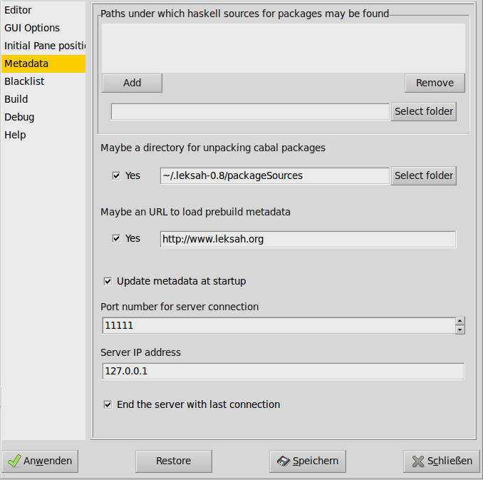

[sub:Metadata-collection]Metadata collection
============================================
** These docs are outdated, we are working on getting them up-to-date for the next release**

Remember, that metadata is the data Leksah has collected from all the
Haskell code (including .hi files for installed packages) it could reach
on your computer.

The initial scan may take a long time (some minutes); when Leksah starts
later, it checks only for changes, but does not scan all files again.
Metadata collection depends on the local configuration, especially the
list of places where Haskell code may be found, which is entered in the
preferences. Occasionally, you may find it useful to rebuild the
metadata.

Metadata collection can be manually triggered: If you select
*Configuration -> Update workspace data*, the metadata for the current
project is collected. This brings the metadata of the current project
up-to-date. You can as well press Ctrl-m or hit this symbol in the
toolbar:

If you select *Configuration -> Rebuild workspace data*, the metadata
for the current project is rebuild.

If you select *Configuration -> Update system data,* Leksah checks, if a
new library has been installed and then collects metadata for additions.

If you select *Configuration -> Rebuild system data,* Leksah rebuilds
all metadata, which may take a long time. Currently the preferred way to
do this is to call leksah-server -rbo +RTS -N2 from the command line.
The reason for this is that the server process may allocate a lot of
memory during collection.

Background infos
----------------

The metadata collection itself proceeds different for workspace and
system packages:

-  For workspace packages Leksah just uses the parser without
   typechecking and maybe .hi files if available.

-  For system packages Leksah uses .hi files and if sources are
   available Haddock as a library.

Collection for system packages works as follows:

#. Packages you installed with cabal from Hackage. If Leksah can’t find
   sources, it does a *cabal unpack* in the source directory you
   specified for this in the preferences (By default
   .\ *leksah-\*\*/packageSources*).

#. Source files in the folders listed as source folder in the
   preferences. Leksah looks for all .cabal files it can find below the
   source folders. Therefore, Leksah collects source information only
   from “Cabalized” projects (i.e., projects that have a .cabal file).
   From this information the file source\_packages.txt in the .leksah
   folder is written. If you miss sources for a package in Leksah,
   consult this file if the source place of the package has been
   correctly found. You can run this step by typing in a terminal:
   *leksah-server -o* (or *–*\ sources).

#. Problems may occur due to preprocessing, header files, language
   extensions, etc. Error message produced while metadata collection
   indicate that not all information for a package was found. If the
   Haddock call doesn’t succeed, Leksah looks if it can download a
   prebuild metadata package from the server, if this option is selected
   in the preferences.

#. The result of metadata collection is stored in the folder
   *.leksah-\*.\*/metadata* in files called *\*.lkshm.* In this folder
   for every package a metadata file is stored (e.g.
   binary-0.4.1.lkshm). These files are in binary format. If you want to
   rebuild just one package you can delete it here and update the system
   metadata. The files .lkshe specify the base path to sources, if the
   collection for sources was successfully or if a metdata file could be
   downloaded for this.

For the workspace packages a different procedure is used.

#. Metadata is collected from the source directories of the packages you
   are working on. The results are stored in a per module base in a
   folder with the package name (*e.g
   .leksah-\*.\*/metadata/package-\*.\*.\*).*

#. Update happens on a per file base only for changed source files.

   [fig:Metadata-Preferences]Metadata Preferences
