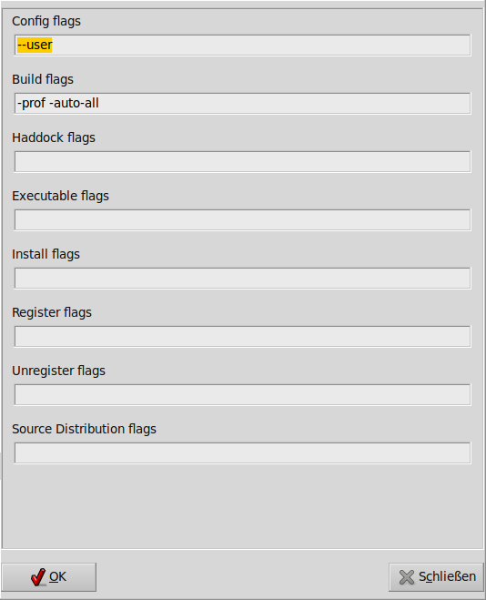

Working with Projects: Workspaces and Packages
==============================================
**These docs are outdated, we are working on getting them up-to-date for the next release**

Haskell organizes software projects in packages, which are managed
independently. A package is compiled and linked as a unit to produce one
or more executables or/and a library. It is installed with the package
manager Cabal. A package can be uploaded to Hackage. And provided
packages are downloaded from Hackage and installed. Packages have
version numbers and specify version ranges for dependencies. Cabal
assures that, if a packages is compiled, correct versions of other
packages are selected.

The difficulties, when working with a project where source code under
development is spread over several packages, are overcome in Leksah with
the concept of a workspace. It combines several packages and allows
smooth working with files from all packages.

Leksah always works in a workspace and always needs at least one
package, to do anything useful. This seems overkill for very simple
projects, where the workspace contains just one package and this package
just one source module producing one executable, but Leksah provides
defaults that reduce the effort to a minimum. The principle to always to
work in a workspace and in a package is beneficial in the long run,
because it gives a smooth transition from a one-shot idea to a complex
projects and integrates the widely used cabal system fully.

Leksah, in addition, saves the state of your work environment with a
workspace: so you can switch between workspaces and get exactly back to
where you stopped working when leaving the workspace: the same files
open in editors and the cursor in the same file and position. When you
open a workspace, and a session is attached to it, Leksah prompts you,
if you want to switch to the session associated with the workspace.
Leksah silently always saves the session for the workspace you are
closing.

If you have auto-build on and you change a file, Leksah detects if this
file belongs to any project in your Workspace. If this is the case, it
builds the package. So the source file you are working on, doesn’t need
to belong to the active package. Leksah will detect and compile the
package for you. The active project is important for the menu items of
the package menu, because they always work on the active package.

-  Background build can be permanently set in Prefs -> Build ->
   Background build. You can temporarily enable and disable it from the
   toolbar with this button: .

-  You can set, if Leksah automatically save all files before building,
   by the setting Prefs -> Build -> Automatically save all files before
   building.

-  Linking can take a long time, and on Windows we can’t interrupt the
   build process in the moment, so it may be an advantage to switch of
   linking. This can be done by: Prefs -> Build -> Include linking in
   background builds. You can temporarily enable and disable it from the
   toolbar with this button: .

-  The same option (disable linking) can be used to disable cross
   package build temporarily.

Cross package build
-------------------

The following is valid in compiler mode: Depending on your settings the
following may happen. After a library has been successfully build, it
will be installed if:

-  “Include linking in background builds” is on and either

   -  “Install always after a successful build” is selected or

   -  “Install if it’s a library with depended packages in the
      workspace” is selected, and it has dependent packages

After this, dependend packages will be build. If you want a background
build, but only for the one package you’re working on, you can
temporarily disable this mechanism, by deselecting .

File Organization with Workspaces
---------------------------------

A workspace is represented by a file (*workspace\_name.lkshws*) in a
directory. You may choose a hierarchical folder structure with a
workspace file at the top and the projects in sub-folders for complex
projects, but you can as well put all *workspaces* in one directory and
put all packages flat. You have to use care when you create a new
workspace file.

Each package directory contains at least a cabal file
(*packagename.cabal*) and typically folders for the source files,
following the usual Haskell ghc convention of hierarchical module names.

Cabal controls the compilation and linking of packages with GHC and puts
the results in a dist folder in the package; this folder is
reconstructed often and may be deleted without loss. In the folder
package\_name/dist/build/executable\_name you find the executable, but
it is also installed in the folder ~ /.cabal/bin (for a build with the
–user flag. You may wish to add this folder to your search path).

Workspace Operations
--------------------

O0.3\ |image|

New workspace
~~~~~~~~~~~~~

Under the menu workspace you find commands to create a new workspace
with a specific name and select the folder in which it should reside.
The windows title and the 3. compartment of the status bar informs you
always about the currently open workspace.

Add packages to the workspace
~~~~~~~~~~~~~~~~~~~~~~~~~~~~~

Open the workspace pane (from menu (Panes Workspace) and do a
right-click to get the pop-up menu to add a package by selecting the
corresponding cabal file.

Open workspace
~~~~~~~~~~~~~~

When starting, Leksah opens the last workspace used. You can change to
another workspace by opening the corresponding workspace file, or by
choosing from the list of recently used workspaces. When opening a
Workspace you can choose to

Clean and make workspace
~~~~~~~~~~~~~~~~~~~~~~~~

A workspace can be cleaned, meaning all packages gets cleaned and must
be recompiled from scratch. Make builds all the packages in a meaningful
order, and installs libraries if needed. It only stops if an error
occurs.

Jump between errors
~~~~~~~~~~~~~~~~~~~

There are menu items to move to the next or the previous error the
compiler found. You can as well use keyboard shortcuts for this: ctr-j
and shift-ctrl-j. It is as well possible to move by pointing to the
error messages in the log pane or error pane.

Add all imports
~~~~~~~~~~~~~~~

If you miss imports (given error messages (“xx is not in scope”) ctrl-r
is adding them automatically to your import list. Limitation: it does so
only, if the modules they export are in a workspace package or are in a
package listed in the build dependencies of the package.

Packages
--------

O0.3\ |image|

The concept of a package is used to handle a unit of work for the
development of some library or executable. It is, in the first place,
the unit Cabal deals with and is a standard in the Haskell community.

Leksah stores data for packages in the standard cabal files. The same
files can be used outside of leksah: for example, you can issue the
command cabal install in the folder that contains the cabal file and
cabal will (as it would inside leksah) configures, compiles and links
and install or register the library or executable produced.

Opening and activating a package
~~~~~~~~~~~~~~~~~~~~~~~~~~~~~~~~

Leksah uses Cabal for package management, and opening a package is done
by opening the corresponding .\ *cabal* file. To open a package select
*Add Package* from the context menu of the workspace, select the
\*.cabal file of the desired package. You must not have more than one
\*.cabal file in a folder!

For workspaces with more then one package, you can activate a package in
the workspace pane, by double clicking on it or by selecting *Activate
Package* from the context menu. The active package is the one that the
commands in the Package menu refers to. (e.g. configure, build,
install).

Leksah shows the currently active package in the third compartment in
the status bar and in the window title. The package file contains
appropriate defaults and for a small program, you may just save and
close it.

New package
~~~~~~~~~~~

To start with a new package select Package / NewPackage from the menu.
Then you have to select a folder for the project, this is by GHC
convention the same name you will give to your package in the package
editor (see ). Then the package editor will open to collect the package
details.

This currently does not work, if an editor for a different package is
open.

Package editor[sub:Package-editor]
~~~~~~~~~~~~~~~~~~~~~~~~~~~~~~~~~~

The package editor ([fig:PackageEditor-1]) is an editor for cabal files
and but you can edit the cabal files in your regular text editor as
well. Leksah works (usually) with the cabal files you and others have
already written, for example those you get when you install a package
from Hackage. Since cabal files offer complex options the editor offers
many separate sub-panes in a list on the right. For a complete
description of all options see the `Cabal User’s
Guide <http://www.haskell.org/ghc/docs/latest/html/Cabal/index.html>`__.

The package editor does currently not support the cabal configurations
feature. If you need cabal configurations, you need to edit the cabal
files as a text file separately. Leksah uses standard cabal files with
no modifications this is no problem just the package editor will not
work for you.

.. figure:: screenshots/screenshot_package_editor_1.png
   :alt: [fig:PackageEditor-1]PackageEditor 1

   [fig:PackageEditor-1]PackageEditor 1

The most important parts of cabal files
~~~~~~~~~~~~~~~~~~~~~~~~~~~~~~~~~~~~~~~

A package has, as a minimal requirement, a and a (default is 0.0.1 –
meaning something like “first idea””). If your code uses other packages
then they must be listed in . This will be at least the *base* package
(which is entered by default). This is independent whether you
downloaded them, e.g., from Hackage produced them yourself. Version
numbers are used to document (and enforce) that older versions of a
program use the corresponding older versions of other packages with
which it was developed originally.

The result of the packages can be an executable and you enter the name
of the Haskell file that contains the main function in the executable
pane and the name of the executable. The result of the package can be a
library; in the corresponding pane you tick off the modules which should
be exposed (i.e., their exports can be used in other packages). Cabal
gives the possibility to build more then one executable from one package
and to build a library and executables from one package.

You have to specify a build info. With build information you give
additional  information, e.g:

-  where the sources can be found (relative to the root folder of the
   project, which is the one with the cabal file).

-  what additional non-exposed or non main modules your project includes

-  compiler flags

-  used language extensions in addition to Haskell 98 (These can also be
   specified in the source files with pragmas)

-  and many more ...

Because more than one executable and a library can be build from one
package, it is possible to have cabal files with more than one build
info. The package editor deals with this by the buttons Add / Remove
Build Info. Every build info gets an index number, and for executables
and a library you specify the index of the build info.

Initializing a package: Clean and configure operations
~~~~~~~~~~~~~~~~~~~~~~~~~~~~~~~~~~~~~~~~~~~~~~~~~~~~~~

Before a package can be acted on it must be configured; you may clean a
package (i.e., delete its *dist* folder) to start afresh.

Configure checks that the packages the current packages depend on are
installed in GHC package manager; it checks for name and version, if you
specify them. If an Hackage package is missing, you can cabal install it
in a terminal window.

Two types of errors regarding packages may be reported:

While configuring, Cabal checks that the packages you have listed in the
depends on section are installed on your computer. If one of your
packages is missing (or missing the version that is needed) you can
install it either – for packages you have the source on your computer,
e.g. because you wrote them – by switching Leksah to the folder where
this package is and configure, build and install them with the command
*cabal install*. For packages that are on Hackage – use a console, go to
the directory where you keep such sources and type cabal install
packageName (possibly package\_name-version); cabal then recursively
installs the package and all packages it depends on.

Separate from this error message the case, where the compiler misses a
module you want to import. Ghc provides an error message, indicating
what package you have to add to the depends on’ section in the cabal
file. Edit the package, add the dependency and do configure/build.

You have to take care as well, that there is a user and a global package
db. Leksah uses the –user flag by default, to minimize errors.

Building
~~~~~~~~

The most frequently used functionality with packages is to make a build.
If the package was not configured before, Leksah does that step
automatically. When you start a build, you can see the standard output
of the Cabal build procedure in the Log pane.

A build may produce errors and warnings. If this is the case the focus
is set to the first error/warning in the Log and the corresponding
source file will open with the focus at the point where the compiler
reports the error. You can navigate to the next or previous errors by
clicking on the error or warning in the log window, or by using the
menu, the toolbar or a keystroke.

In the statusbar the state regarding to the build is displayed in the
third compartment from the right. It reads *Building* as long as a build
is on the way and displays the numbers of errors and warnings after a
build.

This is the symbol, which initiates a build when clicked on the toolbar
(Ctrl-b).

The error pane ([fig:Error-Pane]) shows the errors in the form of a
table and provides the same functionality you find in the log, but it
may be more convenient to use.

.. figure:: screenshots/screenshot_error_pane.png
   :alt: [fig:Error-Pane]Error Pane
   :width: 50.0%

   [fig:Error-Pane]Error Pane

Run
~~~

You can run your program after the build operation has compiled and
linked it. there is a convenient button to start it!

[sub:Background-Build]Background build
~~~~~~~~~~~~~~~~~~~~~~~~~~~~~~~~~~~~~~

Leksah can run builds while you work and highlight errors as it finds
them. This works with a timer that runs continuously in the background.
If there are changes made to any open file it …

-  interrupts any running build by sending SIGINT (this step is OS X and
   Linux only at this point, it’s not working on MS Windows)

-  waits for any running build processes to finish

-  saves all the modified files

-  starts a new build

Current limitation: Because we can’t interrupt the build on windows
there is an option in the Leksah build preferences to have it skip the
linking stage in background builds. This reduces the delay before a next
build starts. Background build and linking can be configured in the
preferences and as well switched on and off from the toolbar.

This is the toggle, which switches background build on or off in the
toolbar.

The Linking toggle that switches background build on or off\ .

Build system flags
~~~~~~~~~~~~~~~~~~

Cabal allows more operations than just build; for example producing
documentation with Haddock (with The “Build documentation” item in the
package menu). For each of these operations you can enter the specific
flags they require for you special case. We give here two often examples
of flags, others work similarly and we recommend that you consult the
respective documentations.

   Package Flags

([fig:Workspace-Menu]) consult the `Cabal User’s
Guide <http://www.haskell.org/ghc/docs/latest/html/Cabal/index.html>`__.

Cabal needs the –user flag (which is set by default in Leksah) to
install the result of a built in the user package database (the
alternative is –global to put the resulting files in global space in
ghc-pkg).

Haddock documentation for the leksah source will not be build, because
it is not a library unless you pass the –executable flag. The flags are
stored in a file called IDE.flags in the root folder of the project.

Import Helper
-------------

A frequent and annoying error is the Not in scope compiler error. In the
majority of cases it means that an import statement is missing and to
write import statements is a frequent and annoying task. In Leksah if
the compiler informs about a missing import, you can choose *Add import*
from the context menu in the log pane. Leksah will then add an import
statement to the import list. If there is more than one module that
exports this identifier, a dialog will appear which queries you about
the module you want to import it from.

Leksah then adds a line or an entry to the import list of the affected
module with the compiler error. Leksah imports individual elements, but
imports all elements of a class or data structure if one of them is
needed. The import helper can work with qualified identifiers and will
add a correct import statement. You can as well select *add all imports*
from the context menu, in which case all *Not in scope* errors ** will
be treated sequentially.

When Leksah does not find an identifier update the Leksah database.

Update Metadata or (Ctrl-m)

The import helper just looks in imported packages, so if you miss a
package import, you have to fix it manually.

Obviously some not in scope errors have other reasons, e.g. you have
misspelled some identifier, which can’t be resolved by adding imports.
After adding all imports, you have to save the file and then start a new
build.
